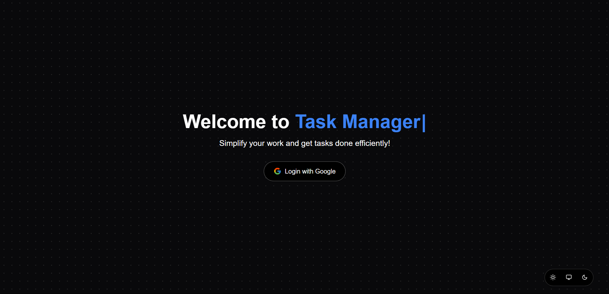
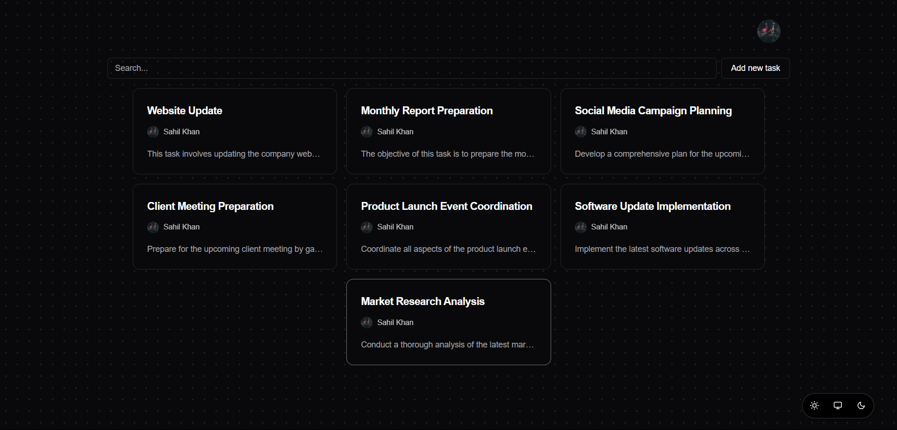

# Task Manager

A sleek and efficient Task Manager built with **Next.js**, **MongoDB**, and **Tailwind CSS**. This project helps you manage your tasks effectively with an intuitive user interface and robust backend capabilities.

---

## Features

- **Task Management**: Add, edit, and delete tasks.
- **Real-time Updates**: Updates task statuses dynamically.
- **Responsive Design**: Fully optimized for mobile and desktop views.
- **MongoDB Integration**: Persistent data storage.
- **Tailwind CSS**: Modern and customizable UI.

---

## Technologies Used

- **Frontend**: Next.js with Tailwind CSS
- **Backend**: API routes in Next.js
- **Database**: MongoDB Atlas

---

## Installation

Follow these steps to set up the project locally:

1. Clone the repository:
   ```bash
   git clone https://github.com/Zer-0ne/task-manager.git
   cd task-manager
   ```

2. Install dependencies:
   ```bash
   npm install
   ```

3. Set up environment variables:
   - Create a `.env.local` file in the root directory.
   - Add the following environment variables:
     ```env
     MONGODB_URI=<your_mongodb_connection_string>
     NEXT_PUBLIC_API_URL=http://localhost:3000
     ```

4. Run the development server:
   ```bash
   npm run dev
   ```

5. Open your browser and visit [http://localhost:3000](http://localhost:3000).

---

## Usage

- **Adding Tasks**: Click the "Add Task" button, enter details, and submit.
- **Editing Tasks**: Select a task to edit its details.
- **Deleting Tasks**: Remove tasks with the delete option.
- **Responsive UI**: Works seamlessly on both desktop and mobile devices.

---

## Screenshots




```html
<!-- Example Markdown for images -->


```

---

## License

This project is licensed under the MIT License. See the [LICENSE](LICENSE) file for details.

---

## Acknowledgements

- [Next.js Documentation](https://nextjs.org/docs)
- [MongoDB Atlas](https://www.mongodb.com/atlas/database)
- [Tailwind CSS Documentation](https://tailwindcss.com/docs)
